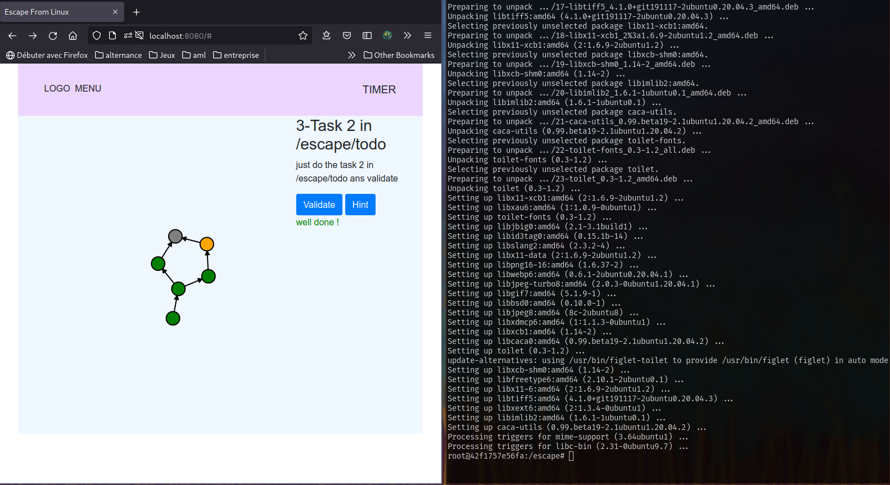
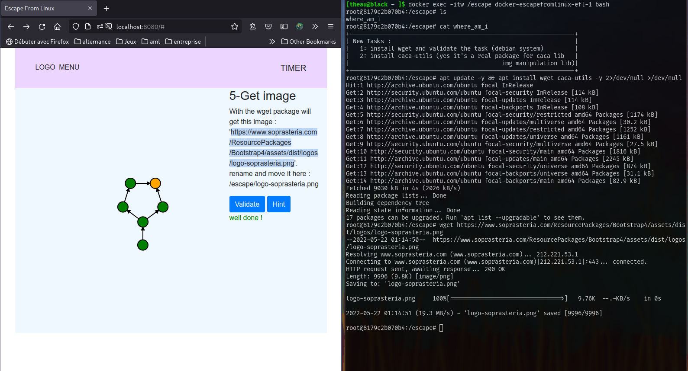

# fichier explicatif pour SopraSteria

demande d'un outil pour sopra -> réalisation de quelques taches

## les taches:

* utilisation de ls (affichage du contenu d'un **dossier**)
* utilisation de cat (affichage du contenu d'un **fichier**)
* installation de wget (utilitaire de téléchargement de fichier)
* installation de img2txt (utilitaire de conversion d'image en text ASCII)
* téléchargement d'une image soprasteria
* affichage de l'indice final

## quelques photos:

La situation initale

Installation de logiciel

Téléchargement de fichier

Indice de fin
